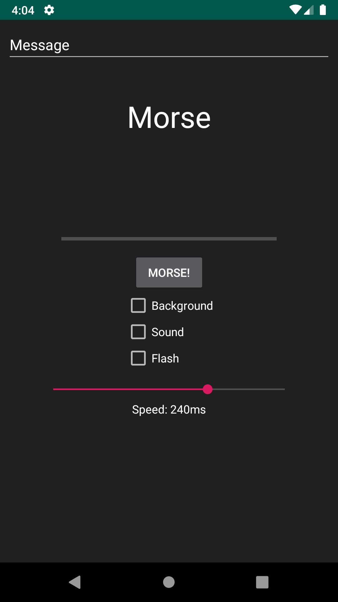
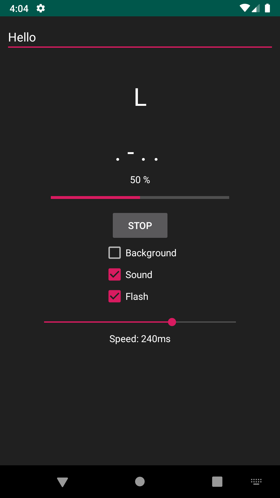
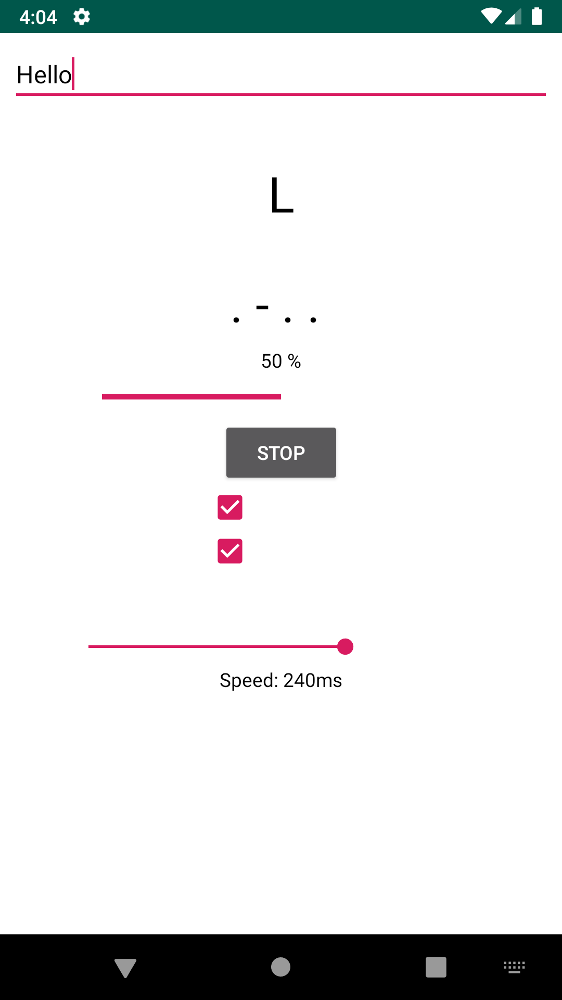

# Morse
a simple app made for text to morse conversion

[Download APK](https://github.com/programminghoch10/Morse/raw/master/app/release/app-release.apk)

Available on Play Store soon!

## Features
Morse is made to convert any given Text into Morse.

### Output
The user is able to decide using checkboxes on which way he wants to send the morse:
* Tone: A nice 440 Hz Sinewave gets faded in and out (if timewise possible)
* Flash: The device camera flash is used to morse slow but bright and visible
* Background: The app's background is also able to flash in the faster speeds

### Morsing
Morse is compliant with all 4 standarized speeds:
* 60 ms
* 120 ms
* 240 ms
* 1200 ms

(ms per dit)

The whole International Morse Alphabet is supported, every unsupported letter gets treated as a space.

(as listed in this german Wikipedia entry: [Morse Tabelle](https://de.wikipedia.org/wiki/Morsezeichen#Standard-Codetabelle))

### User Interface

Morse features a rather simplistic user interface.
* an input field for typing cleartext which will be converted
* 2 text fields showing status, current letter and the according morse code
* a progress bar showing the progress of ongoing morse
* a button to start and stop the morsing process
* 3 checkboxes for selecting outputs:
  * Flash
  * Background
  * Sound
* a slider for selecting the speed
* and a small text field below the slider for displaying the currently selected speed in ms

Morse also adapts if the soft keyboard is invoked, although this will be adjusted, because on some devices with big UI elements or a small screen this results in overlapping components.

## Code Structure

Most of the work is done within the MainActivity, but several tasks such as creating the sound are beeing managed by different classes.

### Sound librarys:

Morse uses 2 different sound libraries at the moment, because of each others better performance in different speeds.

1. [perfectTune by karlotoy](https://github.com/karlotoy/perfectTune) is better in high speeds
1. an own version combinated from perfectTune and some stackoverflow code features an fading in and fading out effect but crackles a lot in high speeds.
1. a third generator from stackoverflow just kept as a source for the own version, but currently unused

### Static variables:
* String TAG: used for debugging and logging purposes
* Int speedbar: current speed selected by user
* Boolean active: if a morsing process is currently active
* Thread worker: second Thread for morsing to not lock up the UI
* Boolean flashavailable: gets set in onCreate(), defines if device has a flash available
* Boolean boxflash: If the Checkbox for the flash is checked
* Boolean boxtone: If the Checkbox for the tone is checked
* Boolean boxbackground: If the Checkbox for the background is checked
* ConstraintLayout constrainlayout: static reference to the constraintlayout for managing it from second Thread
* Context context: static reference to the MainActivity context
* Boolean flash: Variable defining if the flash should be on, used during morsing, processed by a third Thread
* Int PERMISSION_REQUEST_CAMERA: static int for identifying during the permission request procedure

### Important functions:
* onCreate: sets up first time stuff
* encodebuttonclick: starts the whole morsing process including a second Thread or stops it if there is one running
* morse: general function for managing whole morsing process, returns true if morse finished and false if morse has been cancelled
* updateinfo: simple function beeing called mostly from morsing process to update the UI

### Morse Code Map
The whole Morse Code is saved within a big Map.
This makes it easier to manage and also enables requesting the morse code for a letter by using morse.get(Character)

### Function encodebuttonclick:
starts the whole morsing process including a second Thread or stops it if there is one running

This function has an program structure plan available!
[Download PAP](https://github.com/programminghoch10/Morse/raw/master/documentation/Morse.pap)
or
[Download/View PDF](https://github.com/programminghoch10/Morse/raw/master/documentation/morse.pdf)

### Function morse
The function morse does everything interesting and is pretty important, so it gets its own description

1. The Thread camworker is beeing created, which will manage turning on flash later on, because turning flash on and off apparently takes quite some time and would mess up the precise timing of the morse.
1. First for loop generally looping thourgh every character of the input text
   1. If statement checking whether the next character needs special threatment like spaces or not
      * If not it starts a small for loop collecting the morse symbols for display
   1. Second for loop loops through every morsing segment of the character
      1. depending on selected output types, the outputs get activated
      1. either the tone gets played for a defined time or if tone output is deactivated the exact same length is beeing waited
      1. selected outputs get turned off again
      1. the empty dit between morsing signals is beeing waited
   1. The time between letters is beeing waited

This function has an program structure plan available!
[Download PAP](https://github.com/programminghoch10/Morse/raw/master/documentation/Morse.pap)
or
[Download/View PDF](https://github.com/programminghoch10/Morse/raw/master/documentation/morse.pdf)

### Permissions
Morse only needs permission to camera for activating the flash, but it of course works fine without flash if it hasn't got the permission yet.
The camera permission is requested upon start of the app.
The selection box for flash greys out if the permission is missing or if the device lacks a flash.

### XML Files

- strings.xml: the default message text and the sound frequency in Hz is defined here
- colors.xml: the standard colors and the colors for inverting background and text are defined here
- activity_main.xml: standard layout file for the main activity

